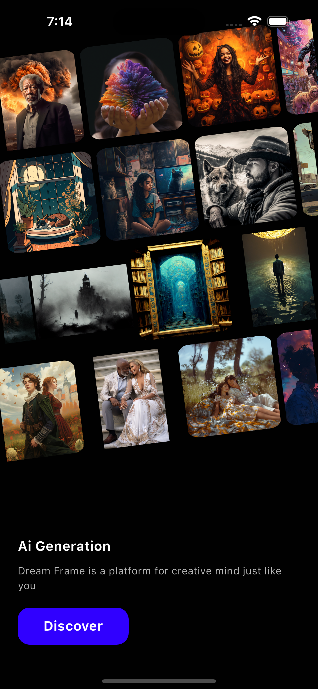

# Landing Page of AI Generation

This project is a Flutter-based landing page showcasing multiple AI-generated arts, all of which are animated to create a dynamic and engaging user experience.

## Project Overview

This landing page demonstrates the capabilities of AI-generated art. The page features several pieces of AI art, each with its unique animation to make the page more interactive and visually appealing.



## Video Demonstration

For a quick overview of the project, watch the [video demonstration on YouTube](https://www.youtube.com/watch?v=NIzC86TIgn4&t=1s).

## Features

- **Animated AI Arts**: Each piece of AI art on the landing page is animated to provide a dynamic user experience.
- **Responsive Design**: The landing page is designed to be responsive, ensuring it looks great on both mobile and desktop devices.
- **Clean and Modern UI**: The user interface is designed to be clean, modern, and easy to navigate.

## Getting Started

### Prerequisites

- [Flutter](https://flutter.dev/docs/get-started/install) should be installed on your machine.

### Installation

1. Clone the repository:
   ```bash
   git clone https://github.com/UsmanAfzal8/Ai-Generation-landing-Page.git
